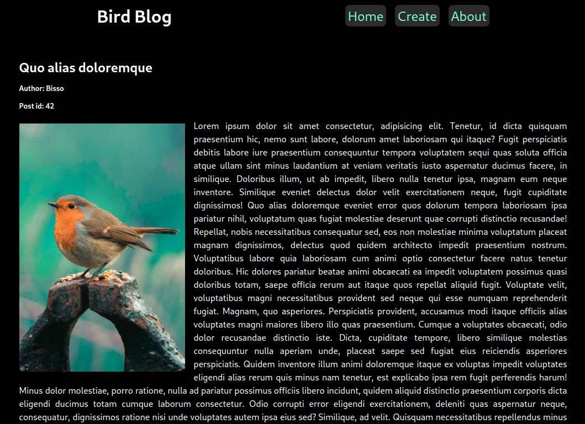

# Bird Blog

## Full stack CRUD App with React in fontend and PHP in backend

## Description

This a simple bird blog website. I have used PHP to create the backend where API routes are created for read, write, update and delete posts. Data are stored into MySQL data base. In the fontend I have used React where data from backed is fetched through Axios and rendered into browser.

This full stack app project is part of my PHP course in Helsinki Business College. I have tried to focus on backend more however the erro handling is not upto the mark yet.



## Setting up the environment

### 1. Clone the repository

```
git clone https://github.com/Bishwajitkuat/react_php_fullstack_bird_blog.git

```

### 2. cd to "react_php_fullstack_bird_blog"

### 3. Install dependency for React app

```
npm install
```

### 4. cd to "php_back_end_bird_blog"

### 5. Install docker container for backend, some data will be added to database.

```
docker compose up -d
```

### 6. cd to "react_php_fullstack_bird_blog"

### 7. Start the React app

```
npm start
```

### 8. All the CRUD operations can be done now

## Technologies used

- PHP
- React
- MySQL
- JS
- CSS
- Axios

## Author

Bishwajit Das
